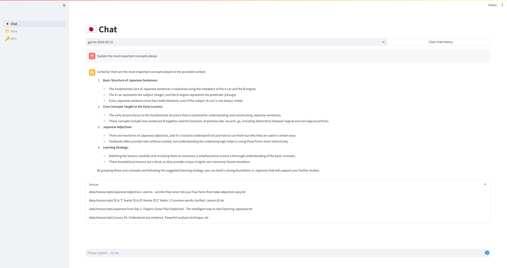

# Japanese RAG

> Japanese RAG is a small RAG (Retrieval-Augmented Generation) chatbot that is able to answer questions about the Japanese language. The chatbot is based on the [Weaviate](https://www.semi.technology/products/weaviate.html) knowledge graph, the [OpenAI](https://platform.openai.com/docs/api-reference/chat) API and [Streamlit](https://streamlit.io/).



### Installation

First, clone the repository and install the dependencies with the following commands:

```bash
poetry install
```

### Setup

1. Create a [secrets.toml](https://docs.streamlit.io/develop/api-reference/connections/secrets.toml) file
2. Create a new Weaviate [Cluster](https://weaviate.io/developers/wcs/create-instance)
3. Create a [Weaviate API Key](https://weaviate.io/developers/weaviate/starter-guides/connect)
4. Create an [OpenAI API Key](https://platform.openai.com/docs/quickstart/step-2-setup-your-api-key)

Finally, add the following credentials to the secrets.toml file:

```text
OPENAI_API_KEY = 'xxx'
WEAVIATE_URL = 'https://xxx'
WEAVIATE_API_KEY = 'xxx'
```

### Run

After that the installation and setup, you can run the Streamlit app with the following command:

```bash
poetry run streamlit run app.py
```

### Import Data

You can upload your data as ZIP-archive (containing individual text-files, [example data](https://github.com/AlexW00/organic-japanese-transscripts)) under the _Data_ tab.

